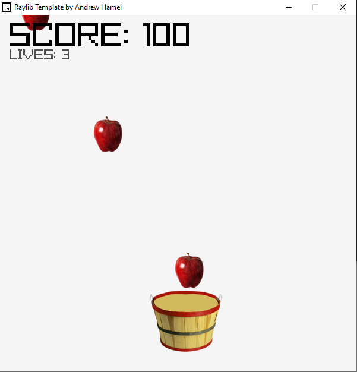
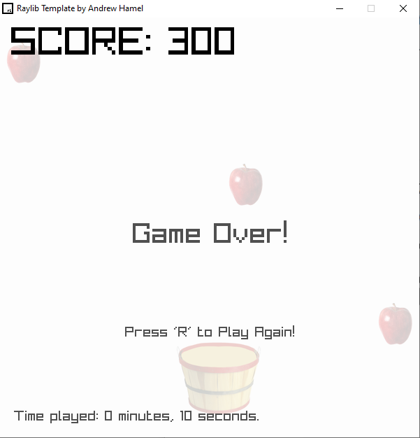

# raylib-AppleCatch
 A super basic Game-Dev Tutorial Classic - Apple Catcher - in all raylib's pure-C glory!

This repo was created as a resource for my [tutorial](https://youtu.be/MIpBqMBxJ8Y) on [Andrew Hamel Codes](https://www.youtube.com/channel/UCETp9EybHuo0AM6tZMzdHxA).

The entirety of the projects code was originally contained within a single file for [this video](https://youtu.be/jWo3uzYbb7Y), to see [this version of the repo](https://github.com/AndrewHamel111/raylib-AppleCatcher/tree/3e8243d88d876566d5c11b6186c983c26d2ddae4) look back to #3e8243d.

It happened both in my High School class and in a University class that I ended up needing to build a game almost exactly like this. It's a perfect example of an early project that includes collision. It removes the complexity of needing to store a variable for the player's position by having the X position of the player paddle controlled by the Mouse Position. It's also a great example for showing off an array, and a simple struct example. I took this chance to show off how we could use a staticly sized array in a bit of a dynamic manner.

## Screenshots

